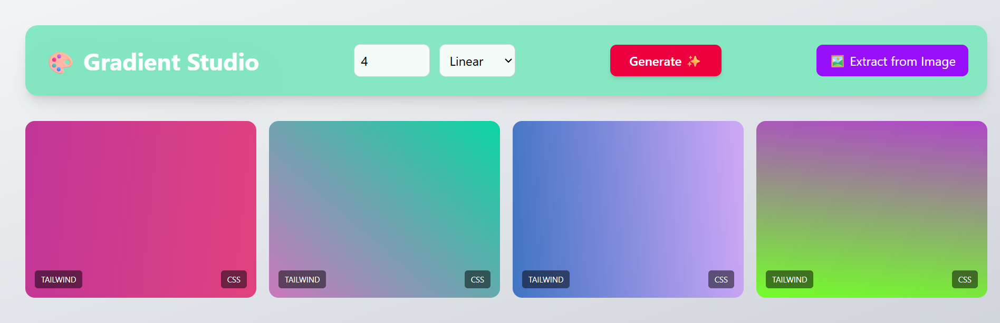
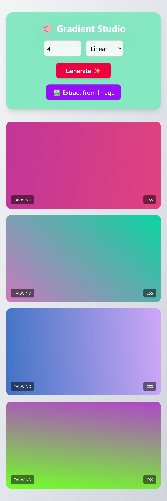

# 🎨 Gradient Studio

[](https://reactjs.org/)
[](https://tailwindcss.com/)
[](https://vercel.com)
[](https://opensource.org/licenses/MIT)

> **Smart gradient generator that extracts color palettes from any image** — Built for designers and developers.

## ✨ Live Demo

🔗 *[View Live Project](https://gradient-studio-yfq3.vercel.app/)*

## 🎯 Problem It Solves

Designers and developers waste hours manually picking gradient colors. **Gradient Studio** solves this by:
- 🎲 Generating random gradients instantly
- 🖼️ Extracting colors from any image to create matching gradients
- 📋 Copying production-ready CSS/Tailwind code with one click

## ✨ Features

### Core Features
- 🎲 **Random Gradient Generation** - Linear & radial gradients
- 🖼️ **Image Color Extraction** - Upload any image → Get top 5 colors
- 📋 **One-Click Copy** - Copy CSS or Tailwind code instantly
- 📱 **Fully Responsive** - Works on all devices

### Technical Highlights
- ⚡ **Optimized Performance** - Smart pixel sampling (10x faster)
- 🧹 **Clean Architecture** - Modular components & custom hooks
- ♿ **Accessible** - ARIA labels & keyboard navigation

## 🛠️ Tech Stack

| Category | Technology |
|----------|------------|
| Frontend | React 18 |
| Styling | Tailwind CSS 3 |
| Image Processing | Canvas API |
| Deployment | Vercel |

📸 Screenshots

### Desktop View


### Mobile View


### Image Extraction Feature View


## 🚀 Quick Start

```bash
git clone https://github.com/YOUR-USERNAME/gradient-generator.git
cd gradient-generator
npm install
npm run dev

🎮 How to Use
Generate Random Gradients
Select number of gradients (1-12)

Choose Linear or Radial type

Click "Generate ✨"

Copy CSS or Tailwind code

Extract Colors from Image
Click "🖼️ Extract from Image"

Upload any image

App extracts colors & creates gradient

Click colors to copy hex codes

📁 Project Structure
text
gradient-generator/
├── src/
│   ├── components/
│   │   ├── GradientCard.jsx
│   │   ├── ColorPalette.jsx
│   │   └── ImageUploader.jsx
│   ├── hooks/
│   │   ├── useGradientGenerator.js
│   │   └── useImageColorExtractor.js
│   ├── utils/
│   │   └── colorUtils.js
│   └── App.jsx
└── package.json

🔮 Future Features
1-Save favorites to LocalStorage
2-Dark mode toggle
3-Share gradient URLs

# 📧 Contact

* **Name:** Abu Huraira
* **Email:** [shk.abuhuraira01@gmail.com](mailto:shk.abuhuraira01@gmail.com)
* **LinkedIn:** [Your Profile Name](https://www.linkedin.com/in/your-profile-url) 
* **GitHub:** [Huraira521](https://github.com/Huraira521)

📄 License
MIT License - Free for personal and commercial use


🐛 Known Issues
Large images (>10MB) may take 2-3 seconds to process

Canvas API requires same-origin or CORS-enabled images

🤝 Contributing
This is a personal portfolio project, but feedback is welcome! Feel free to:

⭐ Star the repository

🐛 Report bugs via Issues

💡 Suggest features via Discussions

